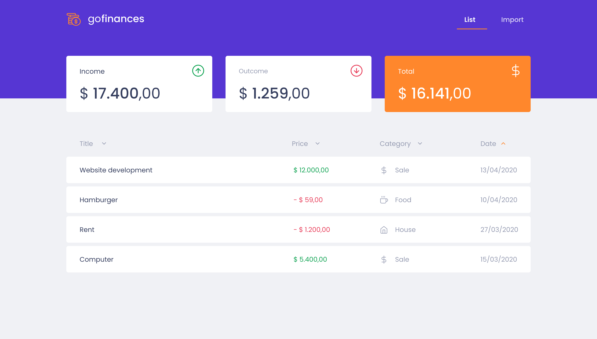
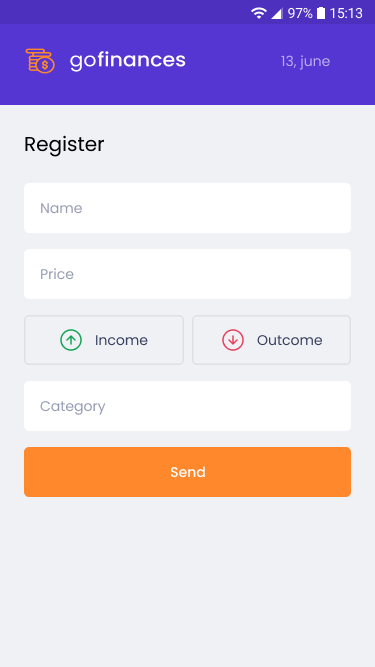
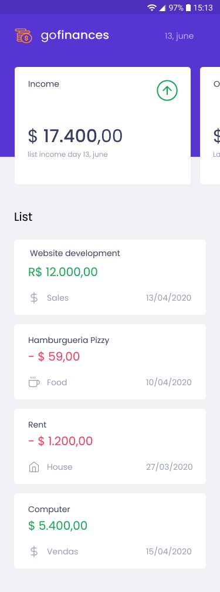

 **Go Finances**


<p align="center">
  
</p>


<h2 align="center">
   [Demonstration here](/)
</h2>

---

<div align="center">
  Gofinance is an application to help people organize their finances and control their income and outcome.
</div>


---

## 💻 Web
 <p align="center">
  
</p>

---

## 📱 Mobile

<p align="center">
  
  
</p>


</div>

---

<h4 align="center">
	🚧  🚀 Under  construction ...  🚧
</h4>


## 🛠 Technology

The following tools were used in the construction of the project:

- [Node.js](https://nodejs.org/en/)
- [React](https://pt-br.reactjs.org/)
- [React Natice](https://reactnative.dev/)


## Features

- [x] Register income/outcome
- [x] Categorized
- [x] import CSV file


## CSV example file

<a href="./img/file.csv" download>
  
</a>


### Prerequisites

Before you begin, you will need to have the following tools installed on your computer:

 - [Git](https://git-scm.com)
 - [Node.js](https://nodejs.org/en/)
 - [Docker](https://www.docker.com/)

In addition, it is good to have an editor to work with the code like

 - [VSCode](https://code.visualstudio.com/)


## Project

# Backend


#### Dependencies

- Cors
- Csv-parse
- Express
- Dotenv
- Multer
- Pg
- Reflect-metadata
- Typeorm


# Frontend

#### Dependencies

- ..


### 🎲 Running the the project

``` bash
# Clone this repository
$ git clone https://github.com/guilhermeseckert/Gofinance.git

#backend

# Access the project folder in the / cmd terminal
$ cd Gofinance

# Access the project folder in the / cmd terminal
$ cd backend

# Install the dependencies
$ yarn

# Run the application in development mode
$ dev:server

```


``` bash
# frontend

# Access the project folder in the / cmd terminal
$ cd Gofinance

# Access the project folder in the / cmd terminal
$ cd frontend

# Install the dependencies
$ yarn

# Run the application in development mode
$ yarn start

```


---
Made with by Guilherme S.Eckert :wave: [Get in touch!](https://www.linkedin.com/in/guilherme-eckert/)
